# Reclaim — User Manual

Reclaim is a health app for your iPhone that helps you recover from injuries. You can log pain and how far it spreads. You can follow a rehab plan from your physio and work out safely around your injuries. It also tracks food, water, sleep, steps and weight, keeps your medical records in one place, and prepares a report for your appointments.

Everything stays **on your iPhone** unless you choose to back it up to Google Drive or use an AI feature. Reclaim doesn't diagnose anything, and it isn't a substitute for your doctor or physiotherapist.

To read this manual on your phone, open the [web version](https://claude.ai/artifact/8DoN4P7PhgnPDP6bHXYWjk).

The screenshots show the app filled with a demo person, Alex. Alex has tennis elbow and a stiff lower back. To regenerate them, see [Updating the screenshots](#updating-the-screenshots).

---

## Contents

1. [Install and first run](#1-install-and-first-run)
2. [Finding your way around](#2-finding-your-way-around)
3. [Today](#3-today)
4. [Logging anything](#4-logging-anything)
5. [Exercise: rehab plan and sessions](#5-exercise-rehab-plan-and-sessions)
6. [Exercise: workouts and fitness](#6-exercise-workouts-and-fitness)
7. [Flare-ups and the morning check](#7-flare-ups-and-the-morning-check)
8. [Health: injuries](#8-health-injuries)
9. [Warning signs](#9-warning-signs)
10. [Weekly check-in and How You’re Doing](#10-weekly-check-in-and-how-youre-doing)
11. [Health Profile and medical records](#11-health-profile-and-medical-records)
12. [Food, water, goals and weight](#12-food-water-goals-and-weight)
13. [Insights, Your Week and the Clinician Report](#13-insights-your-week-and-the-clinician-report)
14. [Timeline](#14-timeline)
15. [AI features](#15-ai-features)
16. [Settings: Apple Health, reminders, backup and privacy](#16-settings)
17. [Questions and troubleshooting](#17-questions-and-troubleshooting)

---

## 1. Install and first run

### Add Reclaim to your Home Screen (do this first)

1. Open Reclaim in **Safari** on your iPhone.
2. Tap **Share** (the square with the arrow), then **Add to Home Screen**.
3. From then on, open Reclaim from the Home Screen icon.

Why it matters:

- **Your data is safe from clearing.** Safari can delete data for websites you haven't opened in a while. Home Screen apps are exempt.
- **Reminders only work this way.** iPhone sends notifications only to Home Screen apps.
- **It runs full screen and works offline.**

Until you do this, Today shows an **Add Reclaim to your Home Screen** card.

### The welcome screen

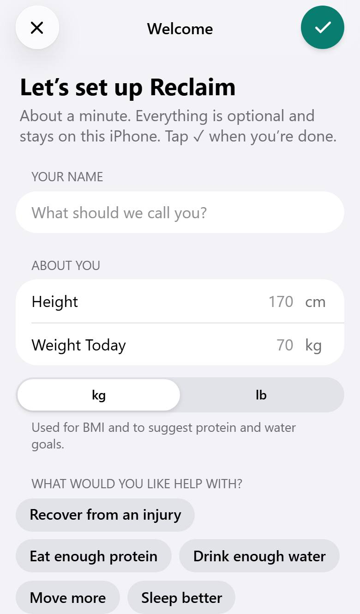

The first time you open Reclaim, it asks a few quick questions. All of them are optional.

- **Your name**: used for greetings and on reports you share with your clinician.
- **Height** and **Weight Today** (in kg or lb): used for BMI and to suggest protein and water goals.
- **What would you like help with?** Pick any of: recover from an injury, eat enough protein, drink enough water, move more, sleep better. Reclaim fills in starting goals for what you pick. You can change them later in **Goals**.

Tap **✓** at the top right when you're done.

---

## 2. Finding your way around

The bar at the bottom has four tabs and a **+** button:

| Tab | What's there |
|---|---|
| **Today** | Your day at a glance: goals, pain, rehab, what you've logged |
| **Exercise** | Your rehab plan, sessions, workouts and the exercise library |
| **Timeline** | Everything you've logged, newest first |
| **Health** | Your injuries, Health Profile, medical records and weekly check-ins |
| **+** (green) | Quick log: pain in two taps, or any other entry |

The round button with your initial (top right of Today) opens **Settings**.

Forms open as sheets. **✕** closes without saving, and **✓** saves. The ✓ stays grey until there's something to save.

After you delete something, an **Undo** message appears for a few seconds.

---

## 3. Today

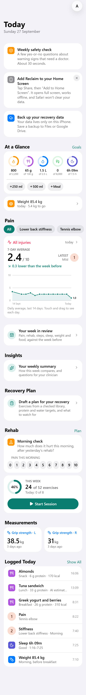

Today changes through the day. From top to bottom:

- **Reminder cards**, shown only when they're due:
  - **Weekly safety check**: see [Warning signs](#9-warning-signs).
  - **Weekly check-in**: see [section 10](#10-weekly-check-in-and-how-youre-doing).
  - **Add Reclaim to your Home Screen**.
  - **Back up your recovery data**: see [Backup](#backup-export-and-restore).
- **At a Glance**: rings for calories, protein, water, steps and sleep, each against your goal. Below them:
  - **+250 ml** and **+500 ml** log a glass or bottle of water in one tap.
  - **+Meal** opens the meal form.
  - **Goals** (top right) changes the targets.
- **Weight**: your latest weight and how far you are from your goal. Tap it for the [Weight page](#weight).
- **Pain**: your 7-day average pain, the latest score, and whether it's lower or higher than the week before.
  - The chart shows the daily average for the last 14 days. Touch and drag along it to see each day.
  - The chips switch between **All** injuries and one injury.
- **Your week in review**: opens [Your Week](#your-week) (on Sundays and Mondays it also shows as a card).
- **Insights**: your AI weekly summary. See [Insights](#insights).
- **Recovery Plan**: an AI draft plan built from a checked exercise library. See [AI features](#15-ai-features).
- **Rehab**:
  - A **flare-up** card, when one is on (see [section 7](#7-flare-ups-and-the-morning-check)).
  - The **Morning check**, the day after a rehab session.
  - This week's progress ring (for example *24 of 52 exercises*) and **Start Session**.
- **Measurements**: your latest grip strength, range of motion and similar readings.
- **Logged Today**: everything you've logged today. Tap an entry to edit it, or tap **Show All** for the [Timeline](#14-timeline).

---

## 4. Logging anything

### Quick log (the green + button)

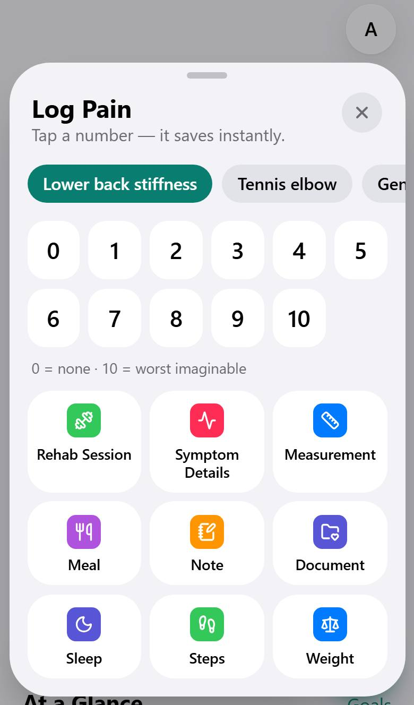

The fastest way to log pain:

1. Tap **+**.
2. Pick the injury (the chips at the top).
3. Tap a number from **0** (none) to **10** (worst imaginable).

It **saves instantly**, with an Undo in case you tapped the wrong number.

Underneath are shortcuts to every other form: **Rehab Session**, **Symptom Details**, **Measurement**, **Meal**, **Note**, **Document**, **Sleep**, **Steps** and **Weight**.

### Symptom details

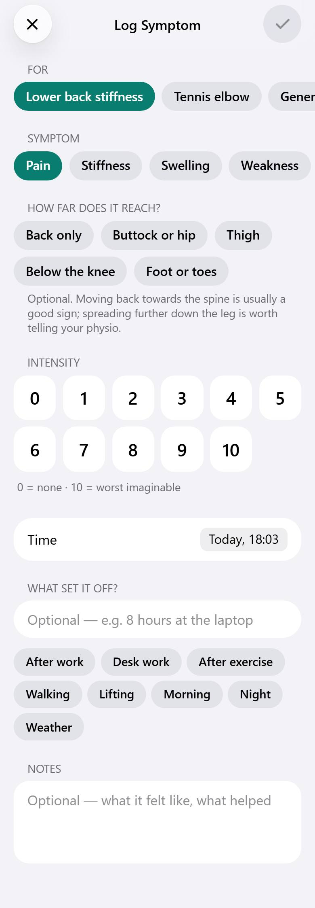

Use this when you want to record more than a number.

- **For**: which injury, or **General**.
- **Symptom**: pain, stiffness, swelling, weakness, numbness, tingling, burning, clicking, instability, fatigue or restricted movement.
- **How far does it reach?** This appears for back and neck injuries. Pick from *Back only → Buttock or hip → Thigh → Below the knee → Foot or toes*, or the arm equivalents for the neck.
  - Pain **moving back towards the spine** is usually a good sign.
  - Pain **spreading further down the leg or arm** is worth telling your physio.
  - Reclaim charts this for you on the injury page.
- **Intensity** from 0 to 10, and the **Time** (defaults to now; tap to change).
- **What set it off?** Type your own, or tap a chip: *After work, Desk work, After exercise, Walking, Lifting, Morning, Night, Weather*. Triggers feed the patterns Reclaim spots and the clinician report.
- **Notes**: what it felt like, and what helped.

### Measurement

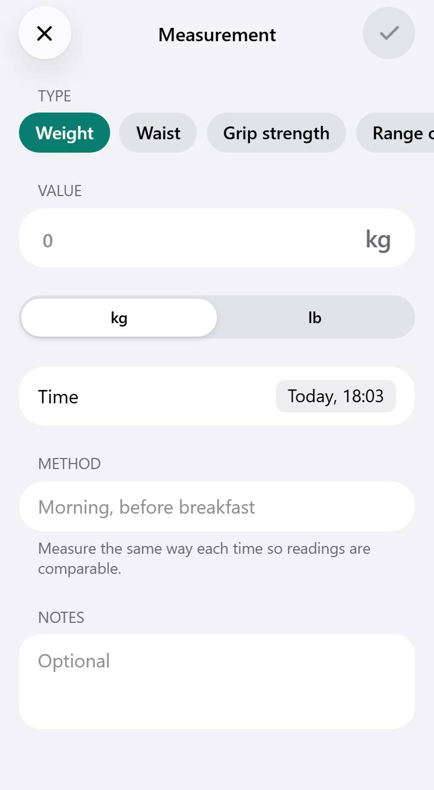

Grip strength, range of motion, swelling and other numbers your physio tracks. Each has a side (left or right) and a method, so repeat readings compare like with like. Measurements show on Today, on the injury page and in the clinician report.

### Note

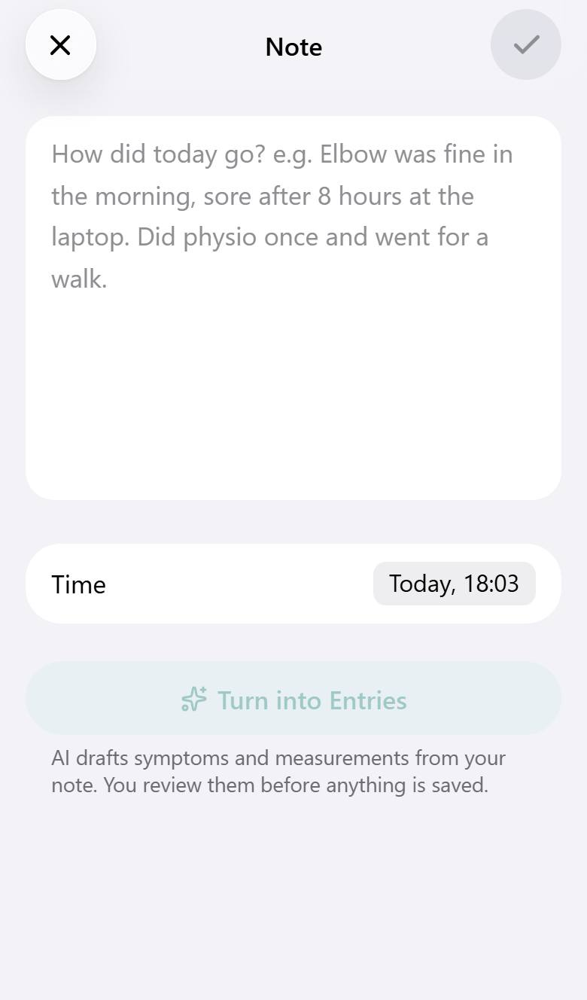

Write anything in your own words. With AI turned on, **Turn into Entries** reads the note and suggests the entries in it: pain scores, measurements, steps and so on. You check each one before it's saved. See [AI features](#15-ai-features).

### Sleep

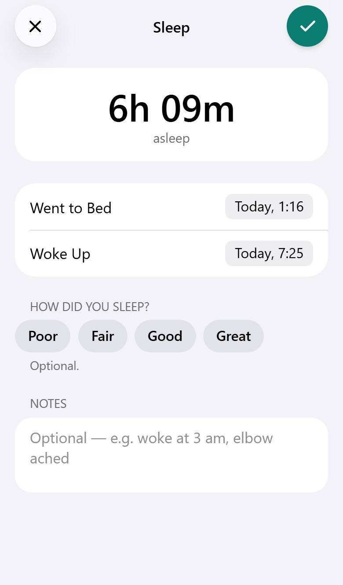

Bedtime, wake time and how well you slept. There's one record per night; logging the same night again updates it.

### Steps and activity

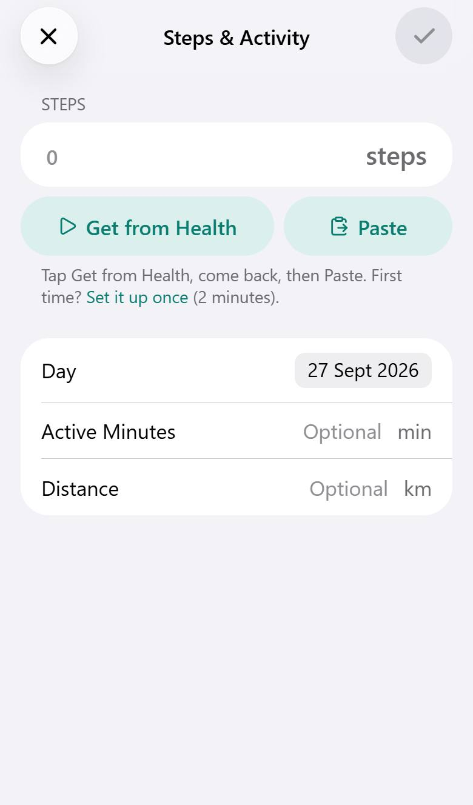

Type your steps, or bring them in from Apple Health:

1. Tap **Get from Health**. This runs your *Reclaim Health* Shortcut, which copies today's steps.
2. Come back to Reclaim and tap **Paste**.
3. Tap **✓**.

The first time, tap **Set it up once** (about 2 minutes); see [Apple Health](#apple-health-steps). You can also add **Active Minutes** and **Distance**. There's one record per day, so importing the same day twice changes nothing.

If your steps jump far above your recent average, the form suggests building up more gradually. That protects your knees and back.

### Meals and food

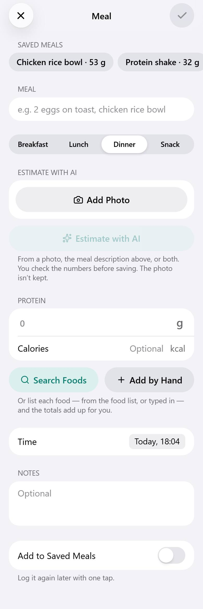

There are several ways to log a meal. Use whichever is quickest:

- **Saved meals**: tap a chip at the top (for example *Chicken rice bowl · 53 g*) to log it again in one tap.
- **Search Foods**: pick foods from the built-in food list (Indian and international foods, with katori, roti and cup portions). The totals add up for you, and you don't need to type a meal name, because it's named after the foods.
- **Add by Hand**: type a food and its numbers.
- **Estimate with AI**: add a **photo** of the plate, describe the meal, or both. AI estimates protein and calories, and you check them before saving. The photo isn't kept.
- Or just type the **protein** and **calories** yourself.

Choose **Breakfast, Lunch, Dinner or Snack**, and turn on **Add to Saved Meals** to reuse the meal later.

| Search | Portion |
|---|---|
| 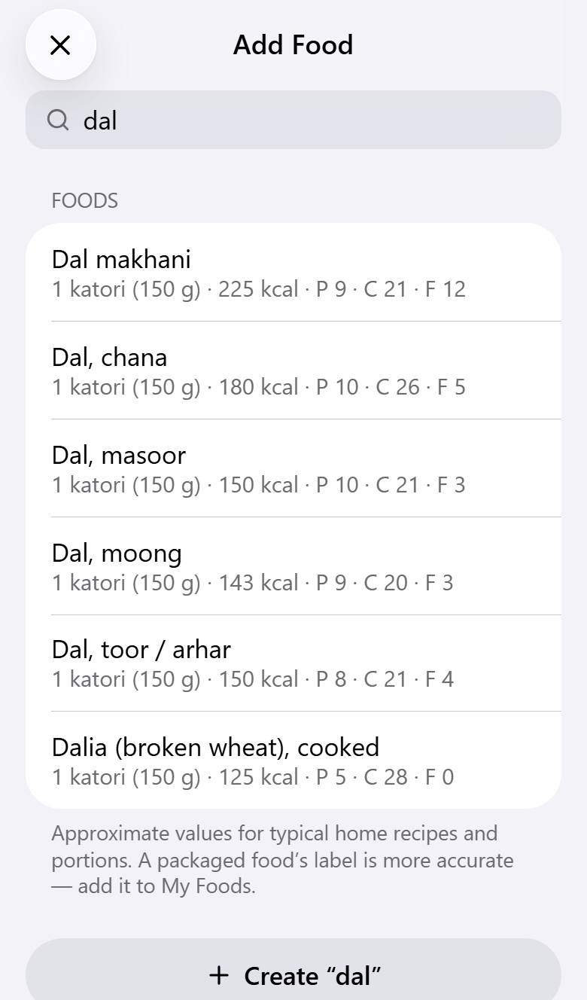 | 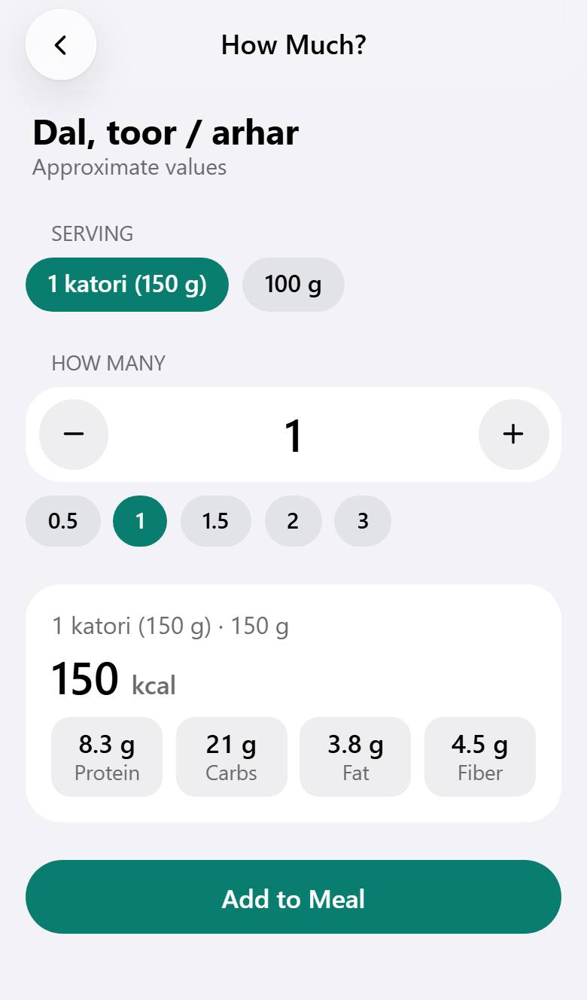 |

After you tap a food, choose the **serving** (for example *1 katori (150 g)* or *100 g*) and **how many**. You can use −/+ or tap 0.5, 1, 1.5, 2 or 3. The card shows calories, protein, carbs, fat and fiber. Tap **Add to Meal**.

### Water and weight

- **Water**: tap **+250 ml** or **+500 ml** on Today or on Nutrition.
- **Weight**: tap **Weight** in the quick log. Weigh at the same time each day (for example, in the morning before breakfast) for a fair trend.

---

## 5. Exercise: rehab plan and sessions

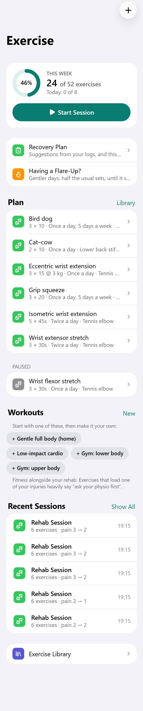

The **Exercise** tab has:

- **This Week**: how many planned exercises you've done (*24 of 52*), today's count, and **Start Session**.
- **Recovery Plan**: an AI-drafted plan to review with your physio (see [AI features](#recovery-plan)).
- **Having a Flare-Up?**: switches to gentler days (see [section 7](#7-flare-ups-and-the-morning-check)).
- **Plan**: your prescribed exercises, with sets × reps (or seconds), weight, how often, and which injury each is for.
  - Tap one to edit it. Turn **Active** off to pause it. Paused exercises are listed separately and don't count towards the week.
  - **Library** (top right) adds more.
- **Workouts**: fitness sessions. See [section 6](#6-exercise-workouts-and-fitness).
- **Recent Sessions**: each session, with pain before → after.

### The exercise library

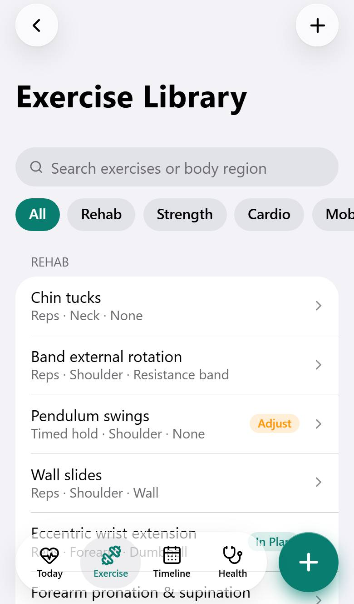

The library holds every exercise. You can search by name or body region, and filter with the chips: **All, Rehab, Strength, Cardio, Mobility**.

Fitness exercises are checked against your injuries:

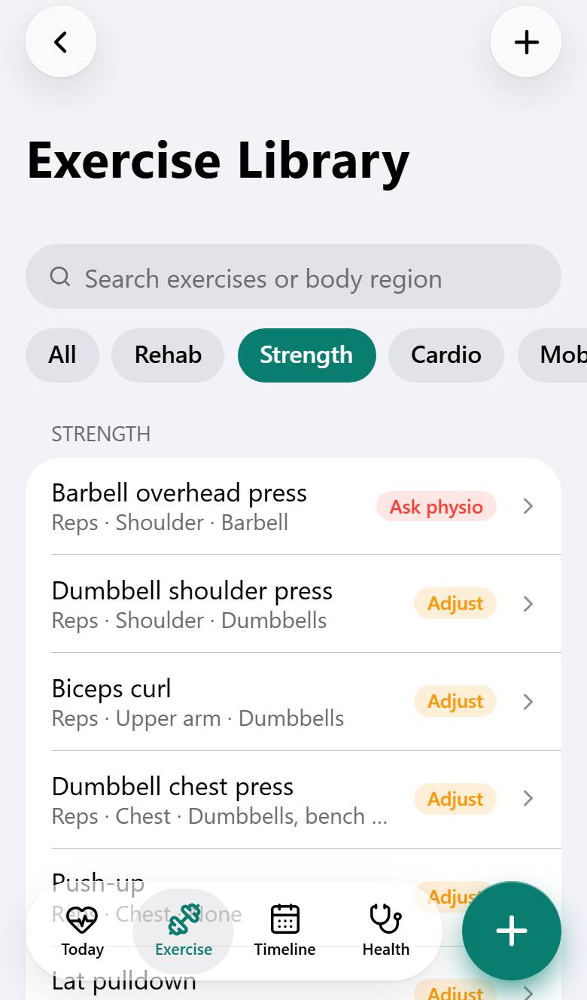

- **Ask physio** (red): the exercise loads one of your injuries heavily, for example a barbell overhead press with a disc problem. Ask your physio before doing it.
- **Adjust** (orange): the exercise is fine with a change. The exercise page says what the change is.

The **+** at the top right creates your own exercise.

### An exercise

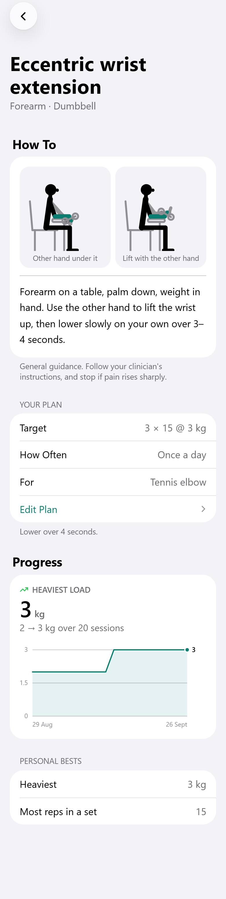

Each exercise page has:

- **How To**: an animated demonstration (or still frames with Reduce Motion on) and plain instructions.
- **Adjust for your injuries** (fitness exercises): what to change for each of your injuries.

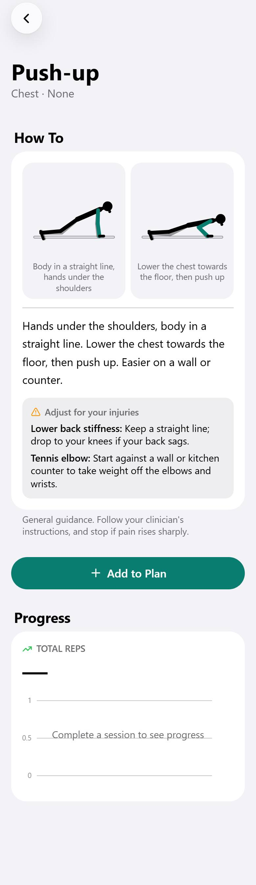

- **Add to Plan**: sets, target, weight, times a day, days a week, and which injury it's for.

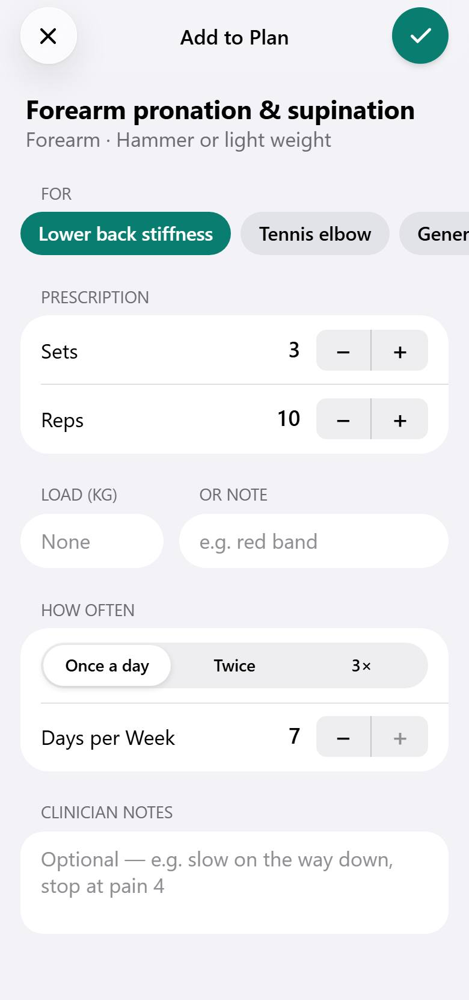

- **Progress**: a chart of your total reps (or seconds, or weight) over time. It fills in after your first session.

### A rehab session

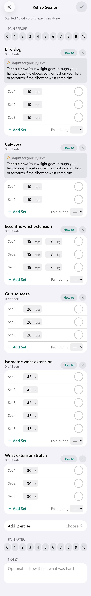

1. Tap **Start Session** (on Today or Exercise).
2. Rate **Pain before** (0–10).
3. For each exercise:
   - Adjust the reps or weight if you did something different.
   - Tap the circle to mark each **set done**.
   - Set **Pain during**. **How to** shows the demonstration again.
4. Rate **Pain after**, add notes if you like, and tap **✓**.

If you close the app mid-session, Reclaim keeps it: you pick up where you left off.

**How Reclaim judges if a session was OK** (the pain-monitoring model physios use):

- Pain **during** exercise up to **5/10** is acceptable.
- It must **settle by the next morning** to no more than 1 point above where it was before.

The **morning check** asks about the second part (see [section 7](#7-flare-ups-and-the-morning-check)). Each week, every exercise gets a verdict: **Ready to Progress**, **Keep Going** or **Ease Off**.

---

## 6. Exercise: workouts and fitness

Workouts sit beside your rehab: strength, cardio and mobility, with a rest timer and personal bests.

### Starter workouts

Under **Workouts**, tap one to add it:

- **+ Gentle full body (home)**
- **+ Low-impact cardio**
- **+ Gym: lower body**
- **+ Gym: upper body**

Then make it your own: tap the pencil to edit, or **Start** to do it. **New** builds one from scratch.

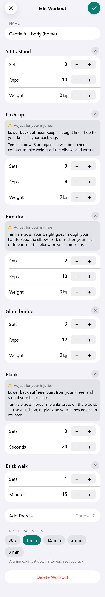

In the editor you can:

- Name the workout.
- Add exercises and set each one's sets, reps or seconds, and weight.
- Set the rest time between sets.

If an exercise in a workout is one to ask your physio about, the workout list says *“1 to ask your physio about”* in red.

### Doing a workout

| The workout | The rest timer |
|---|---|
| 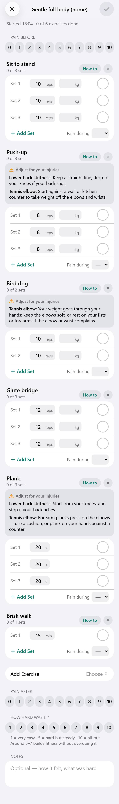 | 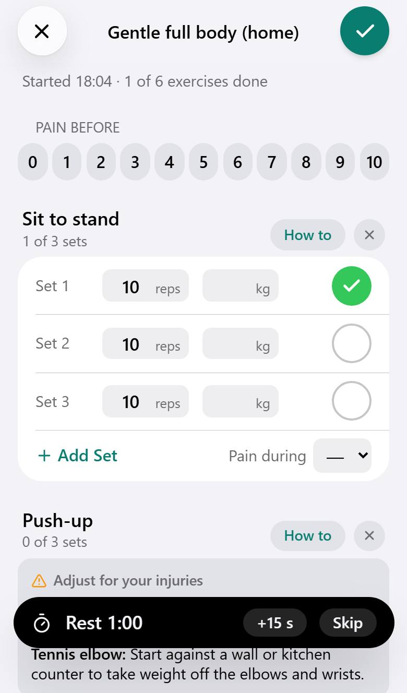 |

- Each exercise shows its sets with **reps** and **kg** (or seconds, or minutes for cardio).
- Exercises that need a change for your injuries show the **Adjust for your injuries** note right there.
- Ticking a set starts the **rest timer** at the bottom. **+15 s** adds time, and **Skip** ends it.
- At the end, rate **Pain after** and **How hard was it?** (1 = very easy, 5 = hard but steady, 10 = all-out). Around 5–7 builds fitness without overdoing it.
- When you beat your best weight, reps or time, Reclaim shows a **New personal best!** message.

Workouts don't count against your rehab week. They're shown separately in [Your Week](#your-week).

---

## 7. Flare-ups and the morning check

### Morning check

The morning after a rehab session, Today asks: *“How much does it hurt this morning, after yesterday’s rehab?”* Tap a number.

- **Settled — carry on**: your pain is back where it was, so the plan can keep building.
- **Not settled yet — go easier today**: do fewer sets or use a lighter weight, and keep pain during exercise at 3/10 or below. This week's check will ease those exercises.

### Flare-up plan

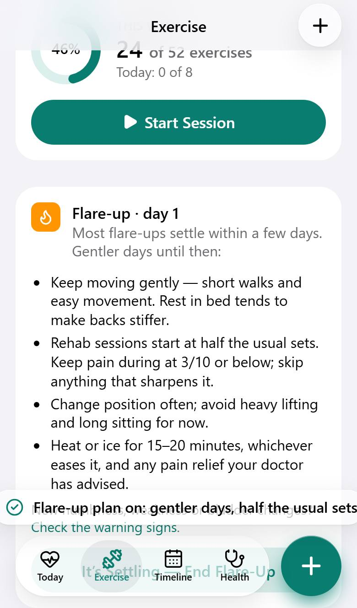

When pain is **7/10 or more**, Today offers **Start Flare-Up Plan**. You can also start one any time from **Exercise → Having a Flare-Up?** While it's on:

- A **Flare-up · day N** card lists what to do: keep moving gently, half the usual sets, change position often, and heat or ice.
- Rehab sessions start at **half the usual sets**.
- There's a link to [check the warning signs](#9-warning-signs) if you get new numbness, weakness or bladder changes.
- After day 3, the card suggests checking in with your physio.

Tap **It’s Settling — End Flare-Up** when it eases. The start and end are noted in your timeline.

---

## 8. Health: injuries

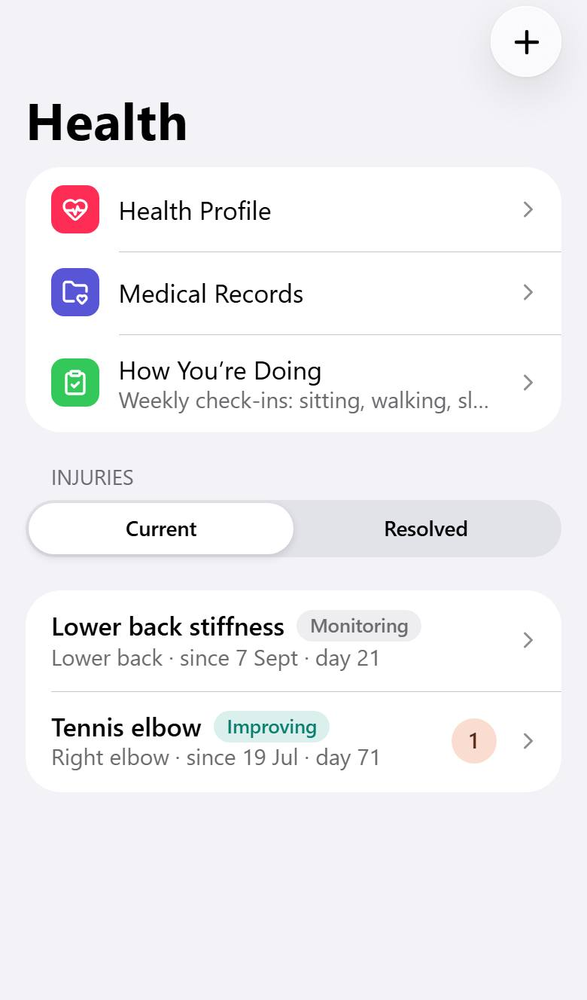

The **Health** tab opens with **Health Profile**, **Medical Records** and **How You’re Doing**. Below them are your **Injuries**, split into **Current** and **Resolved**. Each injury shows its status (*Improving, Monitoring, Active…*), how long it's been, and the latest pain score.

**+** (top right) adds an injury:

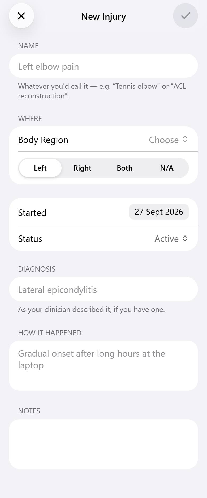

For each injury you can record:

- A name, body region and side.
- When it started, and the status.
- The diagnosis, how it happened, and notes.

### An injury

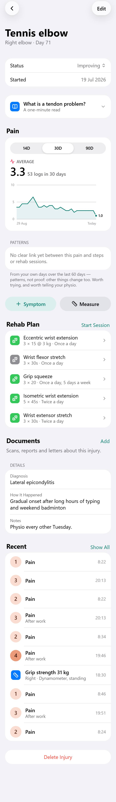

Each injury page has:

- **Status** (tap to change) and **Started**.
- **What is a tendon problem?** (or *disc bulge*, *low back pain*, *ligament sprain*…): a one-minute read on what the condition is, what helps and how long it usually takes, with sources.
- **Pain**: the average and a chart over **14D / 30D / 90D**.
- **How far it reaches** (back and neck): a chart of how far the symptoms spread, and whether that's getting better.
- **Patterns**: links Reclaim finds in your own last 60 days, such as *“pain is higher on days with more steps”* or *“lower the day after rehab”*. These are patterns, not proof, but worth trying and worth telling your physio.
- **+ Symptom** and **Measure**: log straight against this injury.
- **Rehab Plan**: this injury's exercises, plus **Start Session**.
- **Documents**: scans and letters linked to this injury.
- **Details**: diagnosis, how it happened, and notes.
- **Recent**: the latest entries. **Show All** opens them in the timeline.

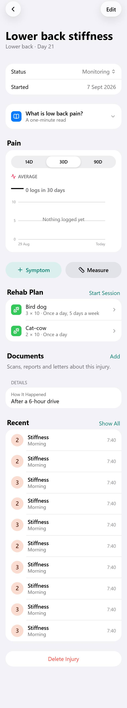

---

## 9. Warning signs

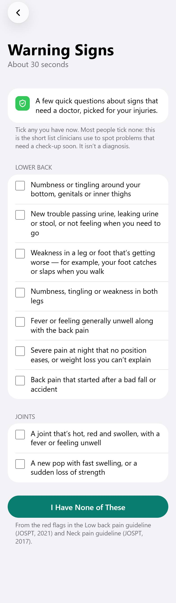

This is a short list of signs that mean you need a doctor soon. It's picked for your injuries (lower back, neck, joints), comes from the JOSPT back and neck guidelines, and takes about 30 seconds.

- Tick any you have now. Most people tick none.
- **I Have None of These** records a clear check.
- If you tick something, Reclaim says how urgent it is:
  - For the most serious signs, such as numbness around the bottom or new bladder trouble, it says to go to an emergency department or **call 112** now, and not to do your exercises until you've been checked.
  - For the others, it says to see your doctor soon.
- Every check is saved in your timeline, so your clinician can see when it was done.

Today reminds you once a week. The [flare-up card](#flare-up-plan) links here too.

---

## 10. Weekly check-in and How You’re Doing

| Check-in | How You’re Doing |
|---|---|
| 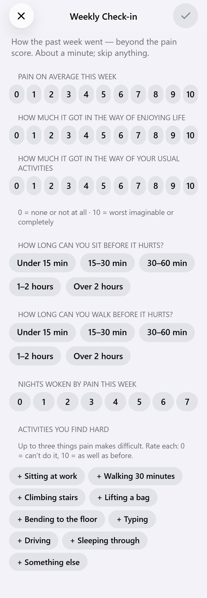 | 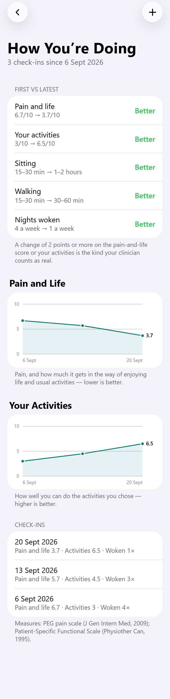 |

Pain scores miss a lot, so once a week Reclaim asks a minute's worth of questions about how pain affects your life. Skip anything you like.

- **Pain on average**, and how much it got in the way of **enjoying life** and your **usual activities**, each 0–10. Together these three are the PEG scale doctors use.
- **How long can you sit** and **walk** before it hurts.
- **Nights woken by pain** this week.
- **Activities you find hard**: up to three things pain makes difficult (for example *Sitting at work* or *Typing*). Rate each one: 0 = can't do it, 10 = as well as before. This is the Patient-Specific Functional Scale. Reclaim remembers your activities for next week.

**How You’re Doing** (Health tab) shows:

- Your first check-in against your latest, each marked **Better / Same / Worse**.
- Charts of *Pain and Life* and *Your Activities*.
- Every check-in.

A change of **2 points or more** is the kind your clinician counts as real.

---

## 11. Health Profile and medical records

### Health Profile

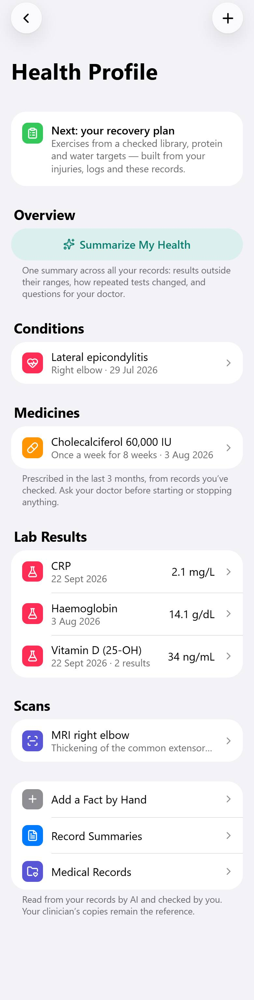

This is everything your records say about you, in one place. Each fact is **checked by you** before it joins the profile:

- **Summarize My Health** (AI): one overview of your records. It covers results outside their ranges, how repeated tests changed, and questions for your doctor.
- **Conditions**: diagnoses from your records.
- **Medicines**: prescriptions from the last 3 months. Older ones are under *Earlier Medicines*. Ask your doctor before starting or stopping anything.
- **Lab Results**: tap one to see every result for that test over time, against its reference range.

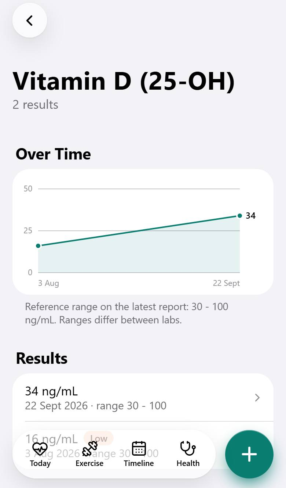

- **Scans**: scan findings.
- **Add a Fact by Hand**: type in a lab result, medicine, condition or finding yourself.

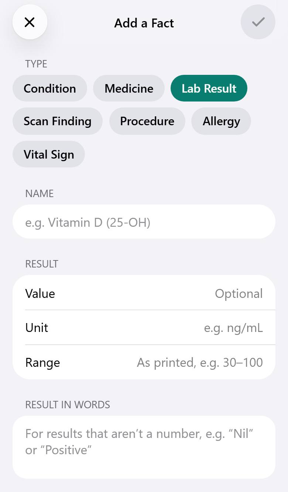

- **Record Summaries**: every AI summary of a record.

### Medical Records

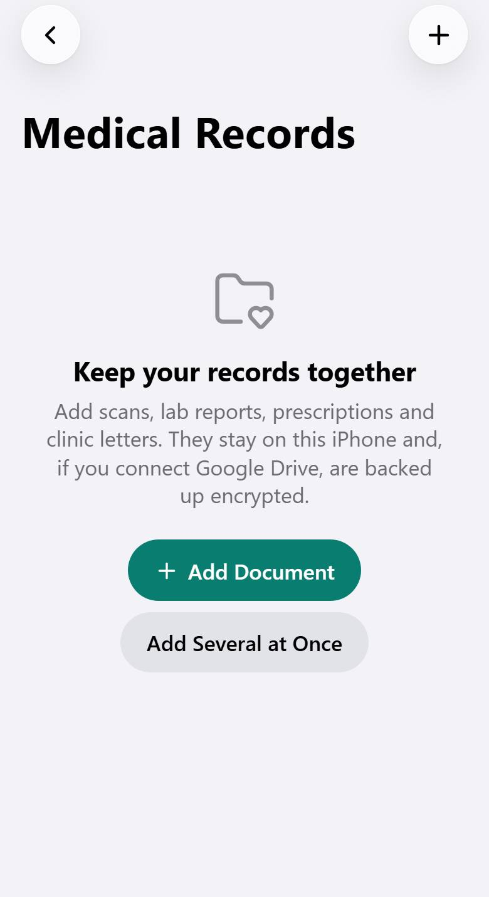

This is where your reports, prescriptions, scans and letters live, as PDFs or photos. Filter them by type with the chips.

**Add Records** (several at once):

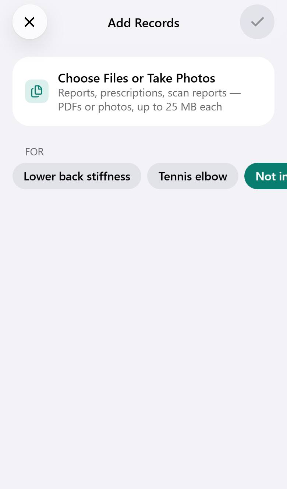

1. Tap **Choose Files or Take Photos**. PDFs and photos up to 25 MB each are accepted.
2. Choose which injury they're **For** (or *Not injury-specific*).
3. If you took several photos of one multi-page report, turn on **Photos Are Pages of One Report** to combine them into one PDF.
4. Tap **✓**. With AI on, each record is read for its title, type and date, plus the lab results, medicines, diagnoses and scan findings in it. You review everything before it's added.

**Add Document** (one at a time, with the details typed in):

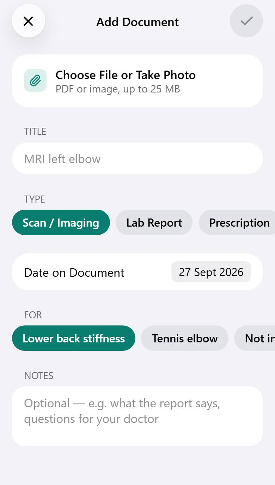

### A record

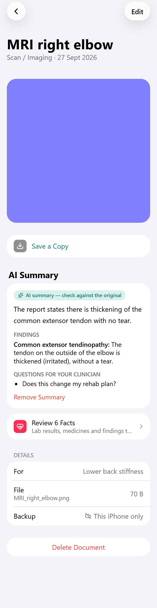

A record's page shows:

- The file itself.
- **Summarize with AI**: a plain-English summary, the findings, and questions for your clinician. It's marked *“check against the original”*.
- **Review N Facts**: the lab results, medicines and findings AI found. Tick the ones that are right and correct any mistakes. Only the facts you confirm reach your Health Profile.

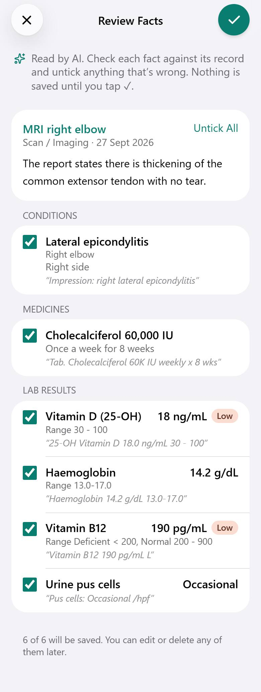

- **Since Last Time**: for a repeat test, what changed since the previous one of the same kind. It shows what's new, what's gone and which numbers moved.
- **Details**: which injury it's for, the file, and whether it's backed up to Google Drive or kept on *This iPhone only*.

---

## 12. Food, water, goals and weight

### Nutrition

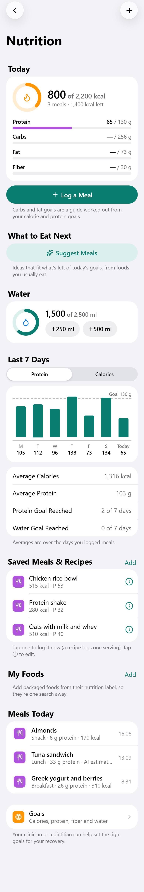

- **Today**:
  - Calories against your goal, and what's left.
  - Protein, carbs, fat and fiber bars.
  - **Log a Meal**.
- **What to Eat Next** (AI): **Suggest Meals** gives ideas that fit what's left of today's goals, using foods you usually eat and your food preference.
- **Water**: today's total, with **+250 ml** and **+500 ml**.
- **Last 7 Days**: protein or calories per day against the goal, averages, and how many days you reached each goal.
- **Saved Meals & Recipes**: tap one to log it. A recipe that makes several servings logs one serving. Tap ⓘ to edit.
- **My Foods**: add packaged foods from their nutrition label, so they're one search away.

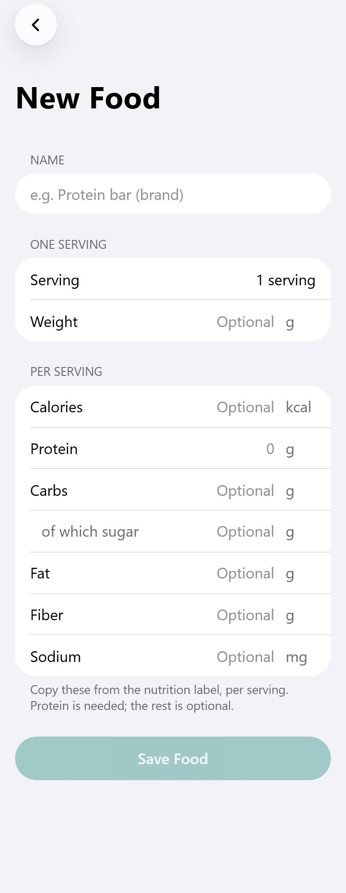

- **Meals Today**: tap one to edit it.

### Goals

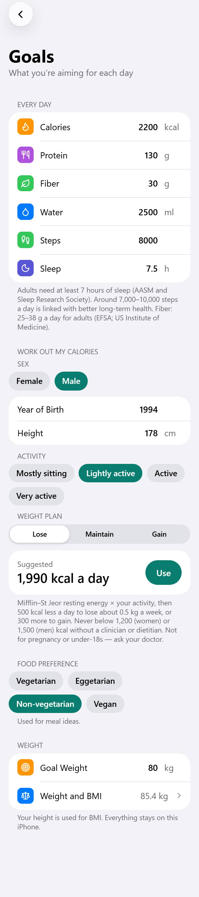

- **Every day**: calories, protein, fiber, water, steps and sleep. The notes under them give the guideline ranges.
- **Work out my calories**:
  1. Enter your sex, year of birth, height and activity level, and whether you want to **lose, maintain or gain** weight.
  2. Reclaim suggests a daily calorie figure (Mifflin–St Jeor; 500 kcal less a day to lose about 0.5 kg a week). It never suggests going below 1,200 kcal (women) or 1,500 kcal (men).
  3. Tap **Use** to set it.
- **Food preference**: vegetarian, eggetarian, non-vegetarian or vegan. This is used for meal ideas.
- **Goal Weight**.

### Weight

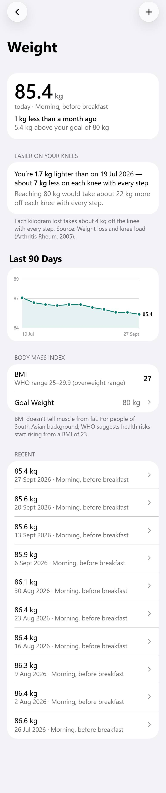

- Your latest weight, the change over a month, and the distance to your goal.
- **Easier on your knees**: each kilogram you lose takes about **4 kg off each knee with every step** (Messier, 2005). Reclaim shows how much you've already taken off, and how much reaching your goal would.
- **Last 90 Days** chart.
- **BMI**, with the WHO range. For people of South Asian background, health risks start rising from a BMI of 23.
- **Recent** weigh-ins. Tap one to edit it.

---

## 13. Insights, Your Week and the Clinician Report

### Insights

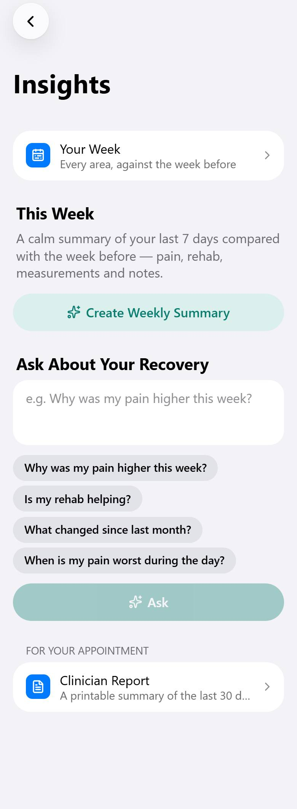

Open it from Today → Insights.

- **Your Week**: see below.
- **This Week → Create Weekly Summary** (AI): a calm summary of your last 7 days against the week before. It covers what the data shows, possible patterns, what the data *can't* establish, and what to discuss with your clinician.
- **Ask About Your Recovery** (AI): type a question, or tap one (*Is my rehab helping? What changed since last month? When is my pain worst during the day?*), then tap **Ask**. Answers come from your own log.

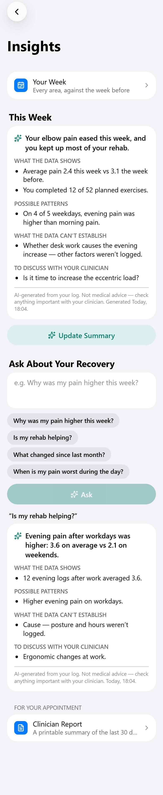

- **For Your Appointment → Clinician Report**.

### Your Week

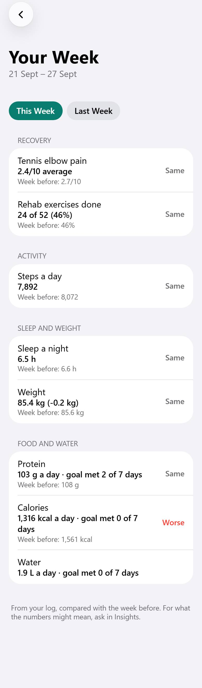

Every area of this week (or **Last Week**) against the week before, each marked **Better / Same / Worse**:

- **Recovery**: pain per injury, rehab done, workouts.
- **Activity**: steps.
- **Sleep and Weight**.
- **Food and Water**: protein, calories and water, including on how many days you met the goal.

Calories count as better when you're **closer to your goal**, not just lower. No AI is involved; it's worked out on your iPhone. On Sundays and Mondays, Today shows a card for it.

### Clinician Report

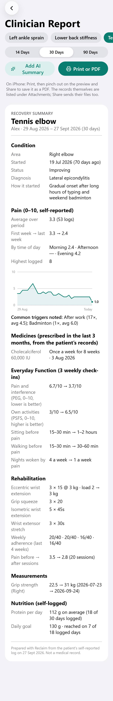

A printable summary for your doctor or physio.

1. Pick the **injury** and the period: **14, 30 or 90 days**.
2. The report shows:
   - The condition.
   - Pain: the average, first week → last week, pain by time of day, the highest score, a chart, and common triggers.
   - Medicines from your records.
   - Rehabilitation: exercises, weekly adherence, and pain before → after sessions.
   - Measurements.
   - Nutrition.
3. **Add AI Summary** (optional) adds a short draft paragraph at the top, marked *“Drafted by AI”*.
4. **Print or PDF**: on iPhone, tap Print, pinch outwards on the preview, then Share to save it as a PDF.
5. **Attachments** lists the records for that injury. **Share the Record(s)** sends the files themselves (MRI reports, blood tests…) alongside the report.

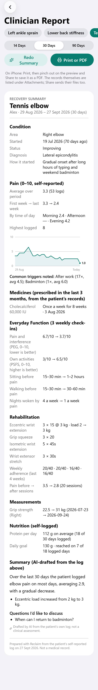

---

## 14. Timeline

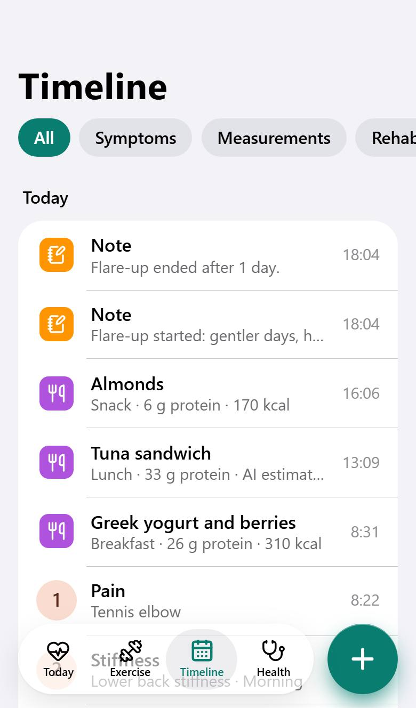

Everything you've logged, newest first, grouped by day. Filter with the chips: **All, Symptoms, Measurements, Rehab, Meals, Sleep, Activity, Notes, Records, Injuries**. Tap any entry to edit or delete it.

---

## 15. AI features

AI is **off until you turn it on**, and it only runs when you tap an AI button.

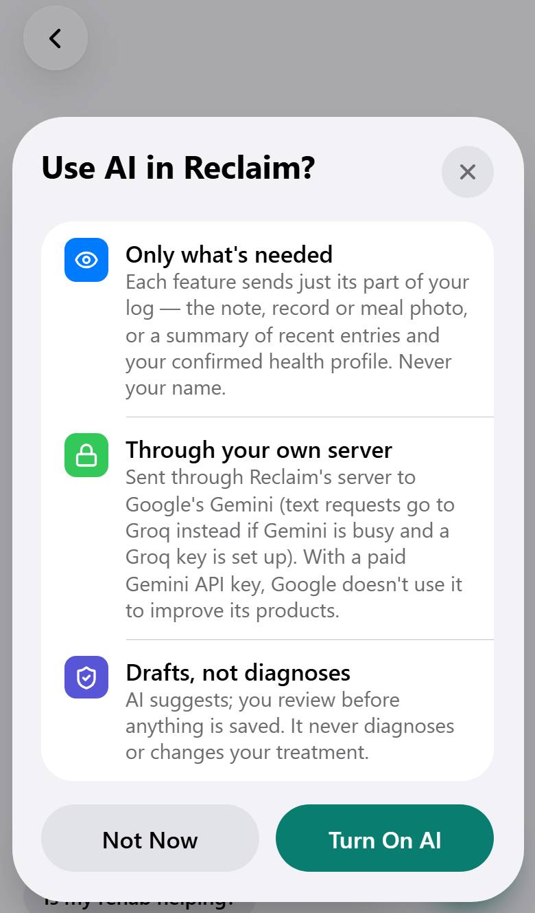

The first time you tap one, Reclaim explains what's sent and to whom:

- Requests go to Reclaim's server, then to Google's Gemini (or Groq if Gemini is busy).
- Each feature sends just what it needs, and **never your name**.
- You review suggestions before anything is saved.

Tap **Turn On AI** to agree. You can turn it off any time in **Settings → AI Features**.

### Show What’s Sent First

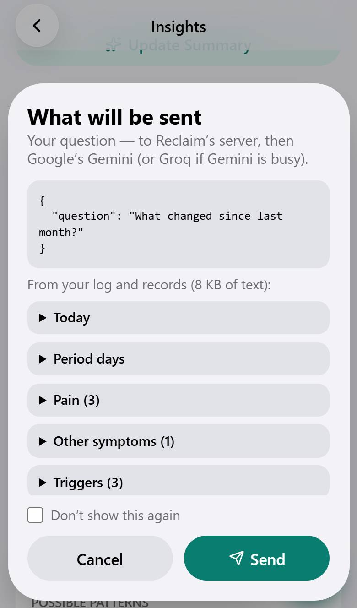

Turn on **Settings → Show What’s Sent First** to see exactly what each AI request contains before it leaves your iPhone. Your question is shown in full; each part of your log is listed and can be expanded. Tap **Send** or **Cancel**. **Don’t show this again** turns the preview back off.

### What AI can do

| Feature | Where | What it does |
|---|---|---|
| Weekly summary | Insights, Today | Your week against the one before, with questions for your clinician |
| Ask a question | Insights | Answers from your own log |
| Note to entries | Note form | Turns a written note into entries you review |
| Meal estimate | Meal form | Protein and calories from a photo or a description |
| Meal ideas | Nutrition | Meals that fit what's left of today |
| Record reading | Add Records, a record | Title, type, date, results, medicines and findings; you confirm them |
| Record summary | A record | A plain-English summary and questions |
| Health overview | Health Profile | Out-of-range results, trends, questions for your doctor |
| Recovery plan | Today, Exercise | A draft plan to show your physio (below) |
| Report summary | Clinician Report | A short draft paragraph |

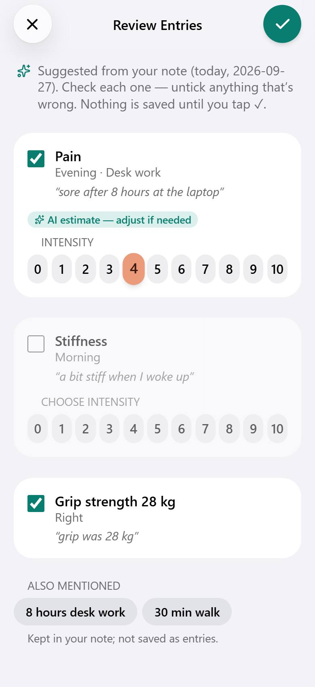

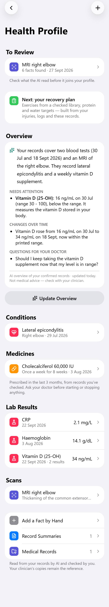

### Recovery Plan

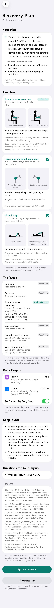

**Create My Plan** drafts a plan **for your physio to check**:

- **Exercises only from Reclaim's checked library.** They're filtered to your open injuries, with doses kept inside safe ranges. Anything else is dropped.
- A reason for each exercise, with how to progress it and its source guideline.
- **This Week**: a verdict for each exercise already in your plan (*Ready to Progress / Keep Going / Ease Off*), from the pain-monitoring model.
- **Daily Targets**: protein and water from your latest weight, using published formulas (not the AI). They're held back if your records show, for example, kidney problems.
- **Keep It Safe**, **Questions for Your Physio**, and the sources.

Nothing changes until you tick the exercises you want and tap **Use This Plan**. **Update Plan** redoes it with your latest logs.

---

## 16. Settings

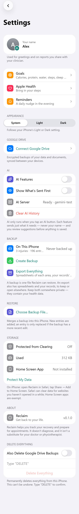

Open Settings from the round button with your initial on Today. From there:

- **Your name and photo**: used for greetings and on reports.
- **Goals**, **Apple Health** and **Reminders**: see below.
- **Appearance**: **System** (follows your iPhone's Light or Dark setting), **Light** or **Dark**.
- **Google Drive**, **AI**, **Backup**, **Restore**, **Storage** and **Delete Everything**.

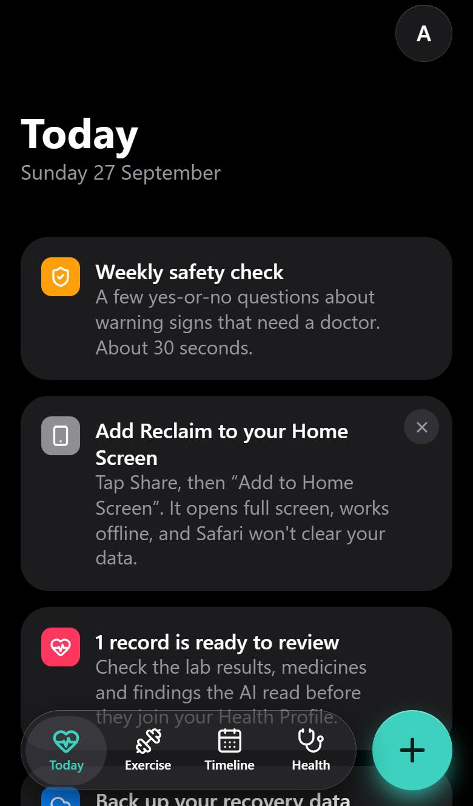

### Apple Health steps

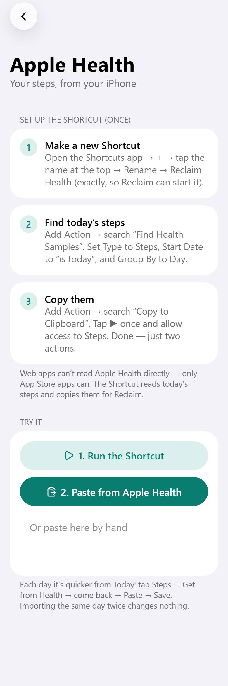

Web apps can't read Apple Health directly, so Reclaim uses a two-action Shortcut. Set it up once:

1. **Make a new Shortcut**: open the Shortcuts app → **+** → tap the name at the top → **Rename** → **Reclaim Health**. Type it exactly like that, so Reclaim can start it.
2. **Find today's steps**: Add Action → search **Find Health Samples**. Set Type to **Steps**, Start Date to **is today**, and Group By to **Day**.
3. **Copy them**: Add Action → search **Copy to Clipboard**. Tap ▶ once and allow access to Steps.

**Try It**: tap **1. Run the Shortcut**, come back, then tap **2. Paste from Apple Health**. (You can also paste into the box by hand.)

Every day after that: **Today → Steps → Get from Health → come back → Paste → Save**.

A [step-by-step illustrated guide](https://claude.ai/artifact/TeLGDUGFJszL5z7mSXPJLy) is also available.

### Reminders

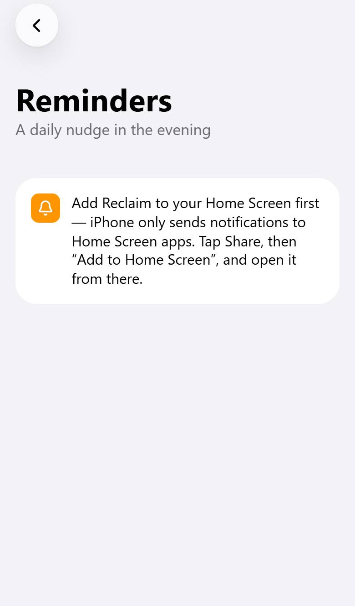

**Daily Reminder** sends one notification in the evening, between about 7:30 and 8:30 pm India time. It tells you what's left for today: rehab, the morning check, the weekly check-in, or steps. On Sundays it also reminds you to look at your week.

- It needs Reclaim **on your Home Screen**. Until then, the page tells you how to add it.
- Turn it on, allow notifications, and sign in with Google (so only you can turn it on).
- **Send a Test Reminder** checks it works.
- The reminder text is worked out **on your iPhone**. No health data is sent to the server.

### Google Drive

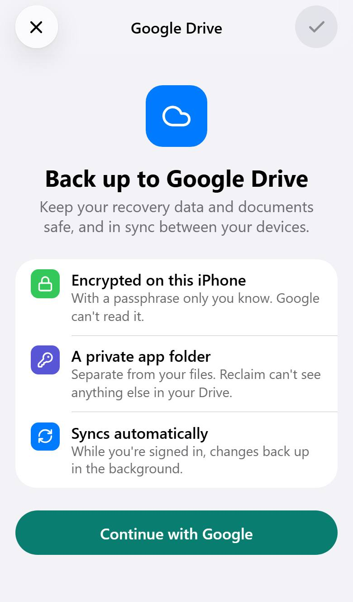

**Connect Google Drive** gives you encrypted backups of your data and documents, synced between your devices.

1. Sign in with Google.
2. Create a **passphrase**. Your data is encrypted with it before it leaves your iPhone, so Google can't read it.
3. On another device, sign in with the same account and enter the same passphrase.

⚠️ **If you forget the passphrase, the backup can't be opened.** Write it down somewhere safe.

Once connected, tap **Sync Now** any time. Documents added on one device are available on the other.

### Backup, export and restore

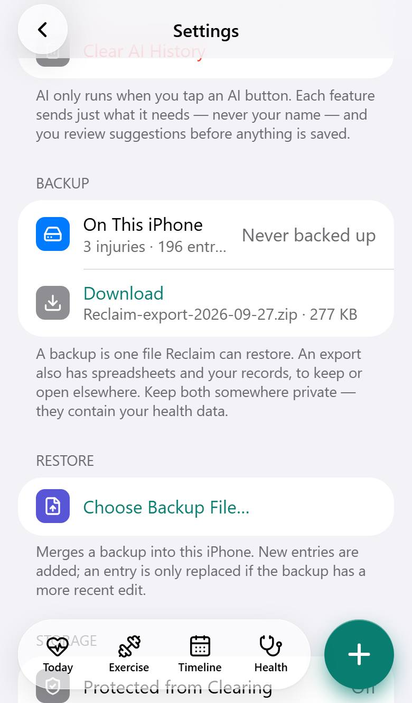

- **On This iPhone** shows how much you've logged and when you last backed up.
- **Create Backup**: one file (`Reclaim-backup.json`) that Reclaim can restore. Save it to Files or send it to yourself.
- **Export Everything**: one ZIP file containing:
  - **spreadsheets**: one CSV per area (symptoms, meals, sleep, sessions, check-ins…). They open in Excel, Numbers or Google Sheets.
  - **records**: your medical files.
  - the full backup.
  - a README.

  Tap **Export Everything**, then **Download**. If some records are only in Google Drive, sign in first to include them; the README lists anything left out.
- **Choose Backup File…** (Restore) merges a backup into this iPhone. New entries are added, and an existing entry is only replaced if the backup has a more recent edit.

Keep backups and exports somewhere private: they contain your health data.

### Storage

- **Protected from Clearing**: tap **Protect My Data** to ask the iPhone to keep Reclaim's data even when storage is low.
- **Used**: how much space Reclaim takes.
- **Home Screen App**: whether it's installed (see [section 1](#1-install-and-first-run)).

### AI

- **AI Features**: turn AI on or off.
- **Show What’s Sent First**: preview every request before it's sent.
- **AI Server**: shows whether the AI server is ready.
- **Clear AI History**: deletes the saved weekly summary, AI answers and note suggestions.

### Delete everything

Type **DELETE** to permanently erase everything on this iPhone. Turn on **Also Delete Google Drive Backups** to erase those too. This can't be undone, so make a backup first.

---

## 17. Questions and troubleshooting

**Is my data private?**
Yes. It lives on your iPhone. It only leaves when you:

- back up to Google Drive (encrypted with your passphrase),
- export or share a file yourself, or
- tap an AI button (only what that feature needs, never your name, and you can preview it first).

**I changed phones.**
Either:

- Connect Google Drive on the new phone with the same passphrase, or
- Restore the backup file: **Settings → Choose Backup File…**

**Steps don't paste.**

1. Run the Shortcut once from the Shortcuts app and allow access to Steps.
2. Check the Shortcut is named exactly **Reclaim Health**.
3. Come back to Reclaim and tap **Paste**; iPhone asks to allow pasting.

**Reminders say they aren't set up.**
Open Reclaim from the **Home Screen icon**, not from Safari, then turn the reminder on again. The page says exactly what's missing.

**The AI says it's busy.**
The free AI tier can queue requests for up to half a minute. Wait and try again.

**Should I do an exercise marked “Ask physio”?**
Not until your physio says so. These exercises load one of your injuries heavily. **Adjust** exercises are fine with the change described.

**When should I stop and get help?**

- Pain during an exercise above **5/10**, or pain that hasn't settled by the next morning: ease off. The weekly check does this for you.
- New **numbness, weakness, bladder or bowel changes**, or numbness around the bottom: run the [warning signs check](#9-warning-signs) and follow what it says. For the urgent signs, call **112**.

---

## Updating the screenshots

The screenshots are taken by the app itself, filled with the demo person, using the production build:

```bash
MANUAL=1 npx playwright test manual --project=iphone-chromium
```

They're saved to `docs/manual/`. The script is `e2e/manual.spec.ts`. It's skipped in normal test runs.
